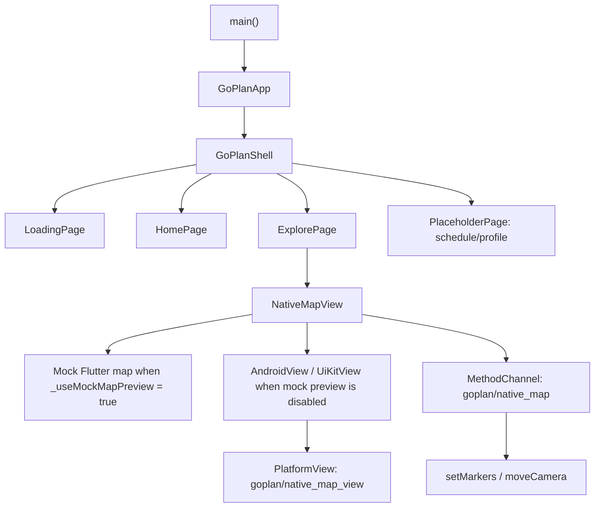

# GoPlan 架构说明

## 产品概览

GoPlan 是一个旅行规划类 Flutter App 原型，用于展示旅行计划、探索附近兴趣点，并在地图上预览路线。当前项目以本地演示数据为主：旅行计划、POI 分类和 POI 点位都定义在 `lib/main.dart` 中，暂时没有后端、账号系统或持久化用户数据。

当前已具备的能力：

- GoPlan 品牌加载页。
- 首页：用户信息、AI 对话组件入口、天气视觉元素、图片横排、旅行计划卡片。
- 探索页：POI 分类筛选和地图区域。
- 日程、我的页面：占位页。
- Android/iOS 原生地图桥接骨架，基于 Flutter PlatformView。
- Web 端高德地图 JS API 接入骨架，基于 Flutter Web `HtmlElementView`。
- Flutter Mock 地图预览，当前通过 `_useMockMapPreview = true` 启用，用于在 x86_64 模拟器上预览地图和 POI 效果。

## 关键假设

- 项目仍处于早期原型阶段，数据来自代码内置的演示数据，不是用户真实数据。
- 首页顶部输入区会打开真实的本地 AI 对话组件，目前使用 Mock 回复；后续计划接入 DeepSeek 大模型。
- 原生地图桥接已存在，但 Android x86_64 模拟器无法加载高德地图 native so，因此模拟器优先使用 Flutter Mock 地图。
- 生产地图 Key 不应提交到仓库。当前平台配置中存在高德 Key，发布前应视为风险并处理。

## 技术栈

| 层级 | 技术 | 代码位置 |
| --- | --- | --- |
| App UI | Flutter / Dart | `lib/main.dart`, `pubspec.yaml` |
| Android 宿主 | Kotlin, FlutterActivity | `android/app/src/main/kotlin/com/tl815/goplan/MainActivity.kt` |
| Android 原生地图 | 高德地图 `MapView`, PlatformView | `MainActivity.kt`, `android/app/build.gradle.kts` |
| iOS 宿主 | Swift, Flutter PlatformView 桥接 | `ios/Runner/AppDelegate.swift`, `ios/Runner/NativeMapView.swift` |
| Web 地图 | 高德地图 JS API 2.0, Flutter Web `HtmlElementView` | `lib/amap_web_view_web.dart`, `web/index.html` |
| App 数据 | 静态 demo 常量 | `demoPlans`, `poiCategories`, `demoPois` |
| 测试 | Flutter widget test 模板 | `test/widget_test.dart` |

## 运行结构

## 数据流

| 来源 | 消费方 | 数据 | 当前行为 |
| --- | --- | --- | --- |
| `demoPlans` | `HomePage`, `PlanCard`, `RoutePreview` | 行程标题、日期、统计、路线节点 | 仅本地渲染 |
| `poiCategories` | `ExplorePage`, `_CategoryChip` | 分类 key、文案、图标资源 | 过滤本地 POI 列表 |
| `demoPois` | `ExplorePage`, `NativeMapView` | POI id/name/lat/lng/category | 渲染到 Mock 地图，或传给原生地图桥 |
| `NativeMapView` | Android/iOS 原生代码 | POI JSON 列表 | 通过 `creationParams` 和 `MethodChannel("goplan/native_map")` 传递 |

## 认证、会话与权限声明

当前代码中没有登录、会话、用户身份、角色或 claim 系统。首页用户信息是静态 UI，所有数据都是打包在 App 内的演示数据。

## 信任边界

| 边界 | 方向 | 跨边界数据 | 当前控制方式 |
| --- | --- | --- | --- |
| Flutter UI 到原生 PlatformView | Flutter -> Android/iOS | POI 列表、地图相机命令 | 仅 App 内部 MethodChannel 调用 |
| App 到高德地图 SDK | Android 原生 -> AMap | 地图 Key、POI 坐标 | SDK 集成，Key 来自 Gradle 占位符 |
| Web App 到高德 JS API | Flutter Web -> AMap JSAPI | Web Key、POI 坐标 | Key 来自 `web/index.html` 的 `goplanAmapConfig` |
| App 到系统权限 | App -> Android/iOS OS | 网络、定位权限声明 | Manifest/Plist 声明；Flutter 层尚未实现运行时权限流程 |

## 已知风险与假设

| 风险 / 假设 | 证据 | 影响 |
| --- | --- | --- |
| 地图 Key 出现在平台配置中 | `android/gradle.properties`, `ios/Flutter/AMap.xcconfig` | 公开发布前可能需要轮换 |
| Widget 测试已过期，仍引用 `MyApp` | `test/widget_test.dart` | 当前 `flutter analyze` 会失败 |
| 部分中文源码字符串出现乱码 | `lib/main.dart`, `MainActivity.kt` | 后续维护和文案校对困难 |
| x86_64 Android 模拟器无法使用高德 native so | `MainActivity.kt` 中的 `supportsAmapNativeLibs()` | 模拟器需要 Mock 地图 |
| 声明了定位权限，但尚无用户授权流程 | `AndroidManifest.xml`, `Info.plist` | 启用真实定位前需要补充权限 UX |
| AI 对话组件目前只使用本地 Mock 回复 | `lib/main.dart` 中的 `_AiDialogBar`, `_AiChatSheet` | DeepSeek 接入前没有真实模型能力；接入后需要补充 API Key、网络错误、审计和限流策略 |

## 不适用的条件文档

- 当前没有事务邮件，所以没有 `emails.md`。
- 当前没有定时任务或后台任务，所以没有 `cron.md`。
- 当前没有公开 Web/SEO 页面，所以没有 `seo.md`。
- 当前没有真正接入 AI Agent、LLM API、Webhook 或外部自动化；AI 对话仍是本地 Mock，所以暂不创建 `automation.md`。接入 DeepSeek 后应新增该文档。

## 相关文档

- `documentation/flows.md`
- `documentation/permissions.md`
- `documentation/variables.md`
- `documentation/tests.md`

