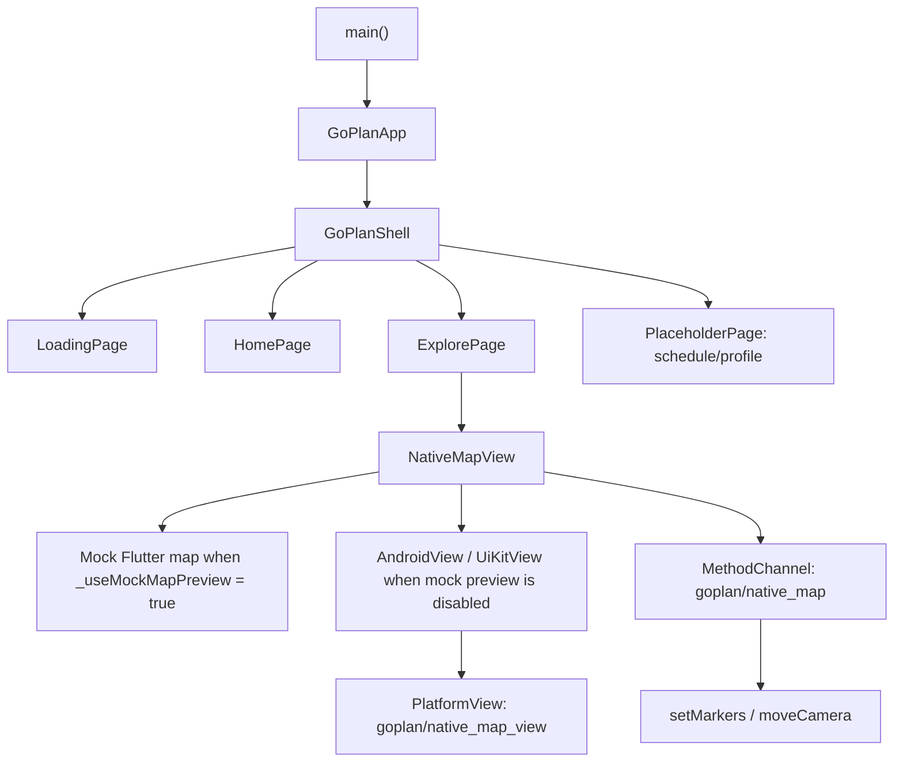

# GoPlan 架构说明

## 产品概览

GoPlan 是一个旅行规划类 Flutter App 原型，用于展示旅行计划、探索附近兴趣点，并在地图上预览路线。当前项目以本地演示数据为主：旅行计划、POI 分类和 POI 点位都定义在 `lib/main.dart` 中，暂时没有后端、账号系统或持久化用户数据。

当前已具备的能力：

- GoPlan 品牌加载页。
- 首页：用户信息、AI 对话组件入口、天气视觉元素、图片横排、旅行计划卡片。
- 探索页：POI 分类筛选和地图区域。
- 日程、我的页面：占位页。
- Android/iOS 原生地图桥接骨架，基于 Flutter PlatformView。
- Web 端高德地图 JS API 接入骨架，基于 Flutter Web `HtmlElementView`。
- Flutter Mock 地图预览，当前通过 `_useMockMapPreview = true` 启用，用于在 x86_64 模拟器上预览地图和 POI 效果。

## 关键假设

- 项目仍处于早期原型阶段，数据来自代码内置的演示数据，不是用户真实数据。
- 首页顶部输入区会打开真实的本地 AI 对话组件，目前使用 Mock 回复；后续计划接入 DeepSeek 大模型。
- 原生地图桥接已存在，但 Android x86_64 模拟器无法加载高德地图 native so，因此模拟器优先使用 Flutter Mock 地图。
- 生产地图 Key 不应提交到仓库。当前平台配置中存在高德 Key，发布前应视为风险并处理。

## 技术栈

| 层级 | 技术 | 代码位置 |
| --- | --- | --- |
| App UI | Flutter / Dart | `lib/main.dart`, `pubspec.yaml` |
| Android 宿主 | Kotlin, FlutterActivity | `android/app/src/main/kotlin/com/tl815/goplan/MainActivity.kt` |
| Android 原生地图 | 高德地图 `MapView`, PlatformView | `MainActivity.kt`, `android/app/build.gradle.kts` |
| iOS 宿主 | Swift, Flutter PlatformView 桥接 | `ios/Runner/AppDelegate.swift`, `ios/Runner/NativeMapView.swift` |
| Web 地图 | 高德地图 JS API 2.0, Flutter Web `HtmlElementView` | `lib/amap_web_view_web.dart`, `web/index.html` |
| App 数据 | 静态 demo 常量 | `demoPlans`, `poiCategories`, `demoPois` |
| 测试 | Flutter widget test 模板 | `test/widget_test.dart` |

## GoPlan 标准领域协议

P0-R2 起，GoPlan 建立独立于 Dify、后端实现和具体 Agent 平台的标准 AI 协议与旅行领域模型。领域层位于 `lib/domain/`，包含 `AssistantRequest`、`AssistantResponse`、`UiAction`、`ClientEvent`、`TripState`、`Itinerary`、`Place`、`BudgetSummary` 和 `ItineraryWarning` 等模型。

依赖方向固定为：

```text
Flutter UI
  -> Controller
  -> GoPlan Domain
  -> Gateway Interface
  -> Dify / Backend / Custom Agent Adapter
```

约束：

- Domain 不依赖 Dify、HTTP、Flutter Widget、BuildContext、地图 SDK 或天气 SDK。
- Dify 未来只是 Adapter，负责把外部服务原始 JSON 转换为 GoPlan 标准领域模型。
- App 页面只能消费 `AssistantResponse` 和领域模型，不直接解析 Dify 原始字段。
- 外部服务原始 JSON 不得直接进入 Widget；必须先经过 Gateway/Adapter 转换和校验。

## TravelAssistantGateway 边界

P0-R3 起，应用层新增 `TravelAssistantGateway`，作为 Controller 与具体 AI/后端服务之间的稳定边界。依赖方向为：

```text
Flutter UI
  -> Controller
  -> TravelAssistantGateway
  -> Adapter
  -> Dify / Backend / Custom Agent
```

约束：

- Gateway 接口位于 `lib/application/assistant/`。
- Gateway 只使用 `AssistantRequest` 和 `AssistantResponse`。
- Domain 不知道 Gateway 的具体实现，也不依赖应用层。
- Dify 原始字段只允许出现在未来的 Dify Adapter 中，不允许直接进入 Widget。
- `conversationId` 必须显式存在于请求和未来的会话状态中，不允许隐藏为全局状态。
- 网络、超时、配置错误、无法解析响应等边界失败使用 `TravelAssistantException`。
- 可解析的业务错误使用 `AssistantResponse.status == error` 返回，不强制抛异常。
- P0-R6.2 已移除旧 `AiTravelAgent` / `DifyTravelAgent` 页面适配链路。正式功能只使用 `TravelAssistantGateway` 实现。

会话标识传递规则：

```text
AssistantRequest.conversationId
    ↓
TravelAssistantGateway
    ↓
Adapter / Provider
    ↓
AssistantResponse.conversationId
    ↓
Controller 持久化
    ↓
下一轮 AssistantRequest.conversationId
```

`conversationId` 是 provider 无关的不透明标识，App 可以保存和回传，但不解析其内部格式。`TravelAssistantController` 和 `ConversationStore` 负责在多轮对话与恢复流程中携带该值。Gateway 和 Adapter 实现不得把会话状态隐藏在全局或单例缓存中。`tripId` 表示旅行项目，`conversationId` 表示 Assistant 会话，两者不能混用。首轮请求的 `conversationId` 可以为 null；Provider 不返回会话标识时，`AssistantResponse.conversationId` 也可以为 null。

## Dify Travel Assistant Gateway

P0-R3.2 新增 `DifyTravelAssistantGateway`；P0-R5.2 已通过 `TravelAssistantController` 将正式 AI 聊天页接入该 Gateway。旧 `DifyTravelAgent` 实现已在 P0-R6.2 移除。

```text
Controller
  -> AssistantRequest
  -> DifyTravelAssistantGateway
  -> DifyRequestMapper
  -> Dify HTTP API
  -> DifyResponseMapper
  -> AssistantResponse
```

职责划分：

- `DifyRequestMapper` 负责把 `AssistantRequest` 转为 Dify `/chat-messages` 请求体。
- `DifyResponseMapper` 负责把 Dify 原始响应转为 `AssistantResponse`。
- `DifyTravelAssistantGateway` 负责 HTTP 传输、配置校验、错误边界和有限重试。
- Gateway 不保存会话；Controller 负责保存和回传 `conversationId`。
- HTTP/网络/配置/解析错误通过 `TravelAssistantException` 表达；可解析业务错误通过 `AssistantResponse.status == error` 返回。

## Travel Assistant Controller

P0-R4 新增 `TravelAssistantController`，作为页面与 `TravelAssistantGateway` 之间的纯 Dart 应用编排层。当前旧聊天页面仍未接入新 Controller，App 运行行为不变。

```text
Flutter UI
  -> TravelAssistantController
  -> TravelAssistantGateway
  -> Dify / Backend / Custom Agent
  -> AssistantResponse
  -> TravelAssistantController State
  -> Flutter UI
```

职责边界：

- Controller 不知道 Dify `/chat-messages` 请求格式，不解析 Dify 原始 JSON。
- Controller 以内存状态保存当前 `conversationId`，Gateway 不保存 `conversationId`。
- `conversationId` 持久化将在后续 `ConversationStore` 中完成。
- Controller 保存当前 `TripState` 与 `Itinerary`；response 中的 null `tripState` 或 null `itinerary` 不会清空已有内容。
- `warnings` 与 `uiAction` 以最新 response 为准，`UiAction.none()` 表示清除旧交互动作。
- `AssistantResponse.status == error` 是可解析业务响应，Controller phase 仍为 `ready`。
- transport、配置、超时、协议解析等失败是 `failure` phase，并通过 `lastFailure` 暴露。
- Gateway automatic retry 是传输层有限重试；Controller `retryLast()` 是用户主动重试上一次操作。
- Controller 使用 `StreamController<TravelAssistantState>.broadcast` 暴露纯 Dart 状态流，不依赖 Flutter 状态管理框架。

## UiAction Dispatcher

P0-R5 新增 `UiActionDispatcher`，用于把 `AssistantResponse.uiAction` 转换为结构化用户交互请求，并在用户完成操作后提交 `ClientEvent`。当前旧聊天页面仍未迁移，Dispatcher 尚未接入真实 Flutter 组件。

```text
AssistantResponse.uiAction
  -> UiActionDispatcher
  -> UiActionInteractionPort
  -> Flutter Component Adapter (next phase)
  -> ClientEvent
  -> TravelAssistantController.submitEvent()
```

职责边界：

- Dispatcher 位于 application 层，不依赖 Flutter、BuildContext、Widget、Dialog、DatePicker、BottomSheet 或 Navigator。
- `UiActionInteractionPort` 是 UI 能力接口；presentation 层后续实现该 Port。
- Dispatcher 只根据 `UiActionType` 调度，禁止根据 AI 文案、title、description 或自然语言猜测组件类型。
- `showItinerary`、`showMap`、`showBudget` 是 passive action，不产生 `ClientEvent`。
- `UiActionType.none` 返回 ignored，`UiActionType.unknown` 返回 unsupported，二者都不抛异常。
- 用户取消输入组件时返回 cancelled，不提交事件。
- 用户明确选择 confirm=false 时仍会提交 confirmation event，不能当作 cancelled。
- Dispatcher 不保存 `conversationId`；状态、会话和 Gateway 调用仍由 `TravelAssistantController` 管理。
- Dispatcher 使用实例级交互锁避免同一实例同时打开两个输入组件；UI 层仍需避免同一 action 因 rebuild 重复触发。

## Flutter UiAction Presentation Adapter

P0-R5.1 新增 Flutter presentation adapter，但当前旧聊天页面仍未接入。预览入口独立于正式 App，默认 `main.dart` 不引用该入口。

```text
AssistantResponse
  -> UiActionResponseListener
  -> UiActionPresentationCoordinator
  -> UiActionDispatcher
  -> FlutterUiActionInteractionPort
  -> Flutter Component
  -> ClientEvent
  -> TravelAssistantController
```

边界与触发规则：

- Flutter adapter 位于 `lib/features/ai_chat/ui_action/`，application/domain/data 仍不依赖 Flutter。
- `BuildContext` 只存在于 Flutter adapter，通过 `contextProvider` 在调用时获取，不进入 application 层。
- Dialog、DatePicker 和 BottomSheet 不允许在 Widget `build` 中直接打开；`UiActionResponseListener` 使用 post-frame callback。
- `UiActionPresentationCoordinator` 使用 `AssistantResponse` 对象实例识别同一次响应，防止 rebuild 重复触发。
- 同一 response 用户取消、失败、passive、ignored 或 unsupported 后不会因普通 rebuild 自动重新打开。
- dispatch 返回 busy 时不会把 response 标记为已处理，后续允许重试。
- 新 `AssistantResponse` 实例即使 action 内容相同，也允许正常展示。
- 长期协议可考虑增加 `action_id`，但当前阶段不修改 Domain。
- Flutter 组件只收集用户输入，最终仍由 Dispatcher 转成 `ClientEvent`，Controller 负责状态和 Gateway 调用。

## 运行结构



## 数据流

| 来源 | 消费方 | 数据 | 当前行为 |
| --- | --- | --- | --- |
| `demoPlans` | `HomePage`, `PlanCard`, `RoutePreview` | 行程标题、日期、统计、路线节点 | 仅本地渲染 |
| `poiCategories` | `ExplorePage`, `_CategoryChip` | 分类 key、文案、图标资源 | 过滤本地 POI 列表 |
| `demoPois` | `ExplorePage`, `NativeMapView` | POI id/name/lat/lng/category | 渲染到 Mock 地图，或传给原生地图桥 |
| `NativeMapView` | Android/iOS 原生代码 | POI JSON 列表 | 通过 `creationParams` 和 `MethodChannel("goplan/native_map")` 传递 |

## 认证、会话与权限声明

当前代码中没有登录、会话、用户身份、角色或 claim 系统。首页用户信息是静态 UI，所有数据都是打包在 App 内的演示数据。

## 信任边界

| 边界 | 方向 | 跨边界数据 | 当前控制方式 |
| --- | --- | --- | --- |
| Flutter UI 到原生 PlatformView | Flutter -> Android/iOS | POI 列表、地图相机命令 | 仅 App 内部 MethodChannel 调用 |
| App 到高德地图 SDK | Android 原生 -> AMap | 地图 Key、POI 坐标 | SDK 集成，Key 来自 Gradle 占位符 |
| Web App 到高德 JS API | Flutter Web -> AMap JSAPI | Web Key、POI 坐标 | Key 来自 `web/index.html` 的 `goplanAmapConfig` |
| App 到系统权限 | App -> Android/iOS OS | 网络、定位权限声明 | Manifest/Plist 声明；Flutter 层尚未实现运行时权限流程 |

## 已知风险与假设

| 风险 / 假设 | 证据 | 影响 |
| --- | --- | --- |
| 地图 Key 出现在平台配置中 | `android/gradle.properties`, `ios/Flutter/AMap.xcconfig` | 公开发布前可能需要轮换 |
| Widget 测试已过期，仍引用 `MyApp` | `test/widget_test.dart` | 当前 `flutter analyze` 会失败 |
| 部分中文源码字符串出现乱码 | `lib/main.dart`, `MainActivity.kt` | 后续维护和文案校对困难 |
| x86_64 Android 模拟器无法使用高德 native so | `MainActivity.kt` 中的 `supportsAmapNativeLibs()` | 模拟器需要 Mock 地图 |
| 声明了定位权限，但尚无用户授权流程 | `AndroidManifest.xml`, `Info.plist` | 启用真实定位前需要补充权限 UX |
| AI 对话组件目前只使用本地 Mock 回复 | `lib/main.dart` 中的 `_AiDialogBar`, `_AiChatSheet` | DeepSeek 接入前没有真实模型能力；接入后需要补充 API Key、网络错误、审计和限流策略 |

## 不适用的条件文档

- 当前没有事务邮件，所以没有 `emails.md`。
- 当前没有定时任务或后台任务，所以没有 `cron.md`。
- 当前没有公开 Web/SEO 页面，所以没有 `seo.md`。
- 当前没有真正接入 AI Agent、LLM API、Webhook 或外部自动化；AI 对话仍是本地 Mock，所以暂不创建 `automation.md`。接入 DeepSeek 后应新增该文档。

## 相关文档

- `documentation/flows.md`
- `documentation/permissions.md`
- `documentation/variables.md`
- `documentation/tests.md`

## AI 聊天页迁移

P0-R5.2 将默认 AI 聊天页迁移到标准 Assistant 链路：

```text
AiChatPage
  -> TravelAssistantChatView
  -> TravelAssistantController
  -> TravelAssistantGateway
  -> DifyTravelAssistantGateway
  -> AssistantResponse
  -> UiActionResponseListener
  -> UiActionPresentationCoordinator
  -> UiActionDispatcher
  -> FlutterUiActionInteractionPort
  -> ClientEvent
  -> TravelAssistantController.submitEvent()
```

Runtime 组装隔离在 `AiChatRuntime`。页面只在 AI 聊天 state 生命周期中创建一次 runtime，持有正式 `http.Client`，并通过 `AiChatRuntime.dispose()` 释放 controller/client。Widget build 不创建 gateway、client 或 controller。

默认 AI 聊天页现在从 `controller.state` 和 `controller.states` 消费 `TravelAssistantState`。`TravelAssistantState.messages` 是页面唯一的业务消息来源。页面不创建业务消息 id，不维护独立 conversation id，也不解析 provider JSON。

日期和其他结构化交互只通过 UiAction 链路处理。页面不再根据 Assistant 文案判断组件类型，用户选择会以 `ClientEvent` 返回，例如 `dateSelected`、`dateRangeSelected`、`optionSelected`、`numberSubmitted` 和 `confirmationSubmitted`。

`conversationId` 由 `TravelAssistantController` 持有：首轮请求发送 null，响应可以更新 state，后续请求复用当前 controller 值。`DifyTravelAssistantGateway` 不隐藏或缓存会话状态。

旧 `AiTravelAgent` / `DifyTravelAgent` 文件已移除。默认 AI 聊天页不创建 `AiTravelAgent`，不调用 `planTrip`，也不读取 `AiTravelAgentReply`。

`ConversationService` 已移除。正式聊天历史和恢复行为使用 `ConversationStore`；本任务中标准行程展示仍保持基础形态，P0-R7 将实现正式 Itinerary UI。

## Conversation Store

P0-R6.0 建立可替换的会话持久化边界：

```text
TravelAssistantState
  -> TravelAssistantSessionMapper
  -> AssistantConversationSnapshot
  -> ConversationStore
  -> SharedPreferencesConversationStore
```

恢复流程：

```text
ConversationStore
  -> AssistantConversationSnapshot
  -> TravelAssistantController initial state
```

`ConversationStore` 位于 application 层，只依赖稳定的 Assistant snapshot 和 summary。SharedPreferences 实现位于 data 层，仅作为 P0 本地缓存；后续可替换为后端或数据库存储，而不改变 controller state 或 domain model。

本地会话 `id` 是 GoPlan 存储 id，不同于 provider `conversationId`。保存相同本地 id 会更新已有记录并保留 `createdAt`，不会追加重复历史项。列表按 `updatedAt` 倒序排序供历史记录使用。

Snapshot 保存可见的用户/Assistant 消息、可选 `ClientEvent`、`TripState`、`Itinerary`、warnings、assistant status 和 provider `conversationId`。它不保存 `TravelAssistantPhase`、`lastFailure`、`failure.cause`、provider 原始响应、待处理 `uiAction`、HTTP 数据或 API Key。恢复 snapshot 时 controller 以 `UiAction.none()` 和 `lastResponse == null` 初始化，因此历史交互不会自动重新打开。

## Conversation Persistence Integration

P0-R6.1 将正式 AI 聊天页和首页探索历史区域接入会话存储边界。

启动与恢复流程：

```text
AiChatPage
  -> AiChatSessionBootstrap
  -> ConversationStore
  -> AssistantConversationSnapshot
  -> AiChatRuntime
  -> TravelAssistantController
```

自动保存流程：

```text
TravelAssistantController.states
  -> AiChatPersistenceCoordinator
  -> TravelAssistantSessionMapper
  -> ConversationStore.save()
```

历史恢复流程：

```text
探索历史
  -> AssistantConversationSummary
  -> AiChatLaunchRequest.resumeById
  -> ConversationStore.getById
  -> TravelAssistantController restore
```

默认聊天入口使用 `AiChatLaunchRequest.resumeLatestForTrip()`，因此当当前 `userId` 和 `tripId` 存在最新本地会话时会恢复它，否则创建新的本地会话 id。显式新会话和显式恢复由 `AiChatLaunchMode` 区分。

本地会话 id 只是 GoPlan 存储 id，由 feature 组装层生成，格式为 `goplan_conv_{timestamp}_{randomHex}`，不同于 provider `conversationId`。provider id 只会恢复到 `TravelAssistantController`，用于下一次 Dify 请求继续 provider 会话；它不展示在 UI 中，也不作为 store key。

`AiChatPersistenceCoordinator` 监听 controller state 变化，默认 debounce 300 ms，跳过空会话，只保存映射后的 snapshot，并在 runtime dispose 前 flush。持久化失败以安全的非阻塞提示报告给页面，不会把 Assistant controller 切到 failure。

恢复 snapshot 会初始化 messages、provider `conversationId`、`TripState`、`Itinerary`、warnings 和 assistant status。它不会恢复 `lastResponse`、`lastFailure`、`TravelAssistantPhase` 或待处理 `uiAction`，因此历史动作不会重新打开，恢复期间也不会发送 Dify 请求。

首页探索历史列表现在读取 `ConversationStore.listForUser()`，展示按 `updatedAt` 倒序排序的 `AssistantConversationSummary`。选择某个 summary 会用 `resumeById(summary.id)` 打开正式 `_AiChatPage`。

P0-R6.2 已移除 `ConversationService`、`AiConversation`、旧探索页兼容聊天块，以及未使用的旧 Agent 文件。SharedPreferences 仍只是 P0 本地缓存；正式版本应通过后端存储同步会话。

## 已移除的旧聊天链路

历史记录，不再使用：

```text
ConversationService
  -> AiConversation / ConvMessage
  -> 旧探索页会话详情
  -> AiTravelAgent / DifyTravelAgent
```

当前正式生产链路：

```text
AiChatPage
  -> AiChatRuntime
  -> TravelAssistantController
  -> TravelAssistantGateway
  -> DifyTravelAssistantGateway
```

当前正式历史链路：

```text
ConversationStore
  -> AssistantConversationSnapshot
  -> TravelAssistantController
```

## Standard Itinerary Presentation

P0-R7 建立标准 Itinerary 展示层，正式 AI 聊天页只从 `TravelAssistantState.itinerary` 读取当前最新行程，并在聊天消息区末尾展示一份摘要卡。

```text
AssistantResponse.itinerary
  -> TravelAssistantController
  -> TravelAssistantState.itinerary
  -> ItineraryOverviewCard
  -> ItineraryDetailPage
```

边界规则：

- Itinerary UI 位于 `lib/features/plan/itinerary/`，只消费标准 `Itinerary`、`ItineraryDay`、`ItineraryItem`、`Place`、`BudgetSummary` 和 `ItineraryWarning`。
- UI 不读取 Dify 原始 JSON，不读取 `planDraft`，不解析 provider `answer` 或 `replyText`。
- legacy `planDraft` 兼容转换只允许发生在 `DifyResponseMapper`，转换后的标准 `Itinerary` 才能进入 UI。
- 聊天页只展示一个当前最新行程；新 response 带来 itinerary 时替换同一位置，need-input 或业务错误未携带 itinerary 时保留已有行程。
- 历史恢复后，`AiChatRuntime` 从 Snapshot 初始化 `TravelAssistantController`，页面直接显示恢复出的 `Itinerary`，不会重新请求 Gateway 或重新触发 UiAction。
- `ItineraryOverviewCard` 提供聊天页摘要，`ItineraryDetailPage` 展示全部日程、预算和 warnings；二者不依赖 Gateway、ConversationStore、Dify、HTTP、地图或天气。
- Budget 和 warnings 属于标准行程展示能力。UI 展开状态、滚动位置和 GlobalKey 不持久化。
- `showItinerary` 和 `showBudget` passive action 只在页面层滚动到现有区域，不创建 `ClientEvent`；`showMap` 在 P0-R7 仅显示安全提示。
- 地图 Marker、每日路线和正式 showMap 行为留到 P0-R8；行程局部修改留到 P0-R9。

